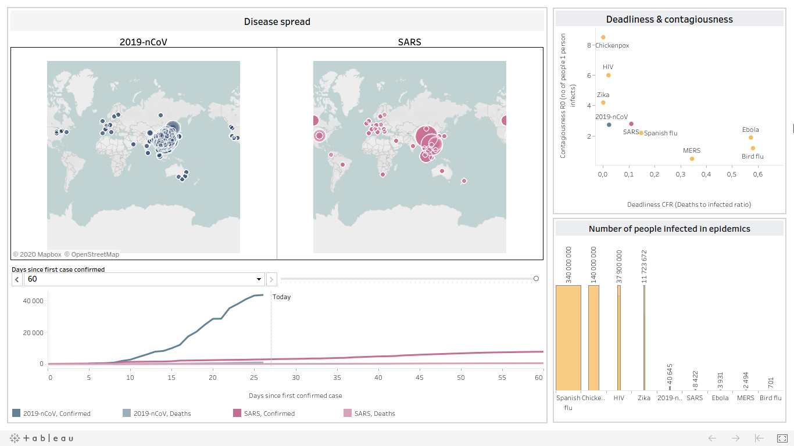
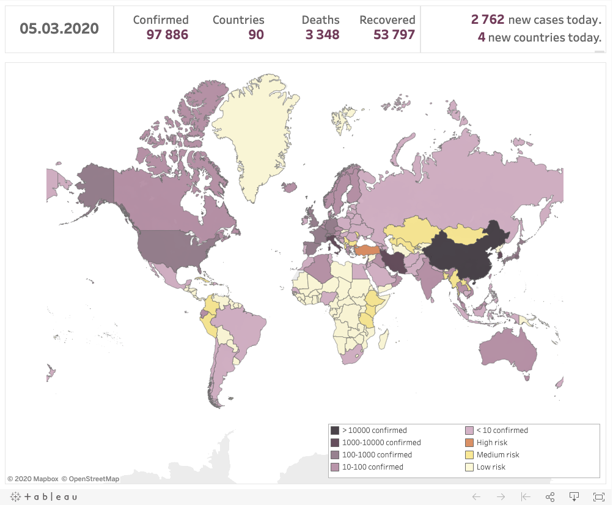
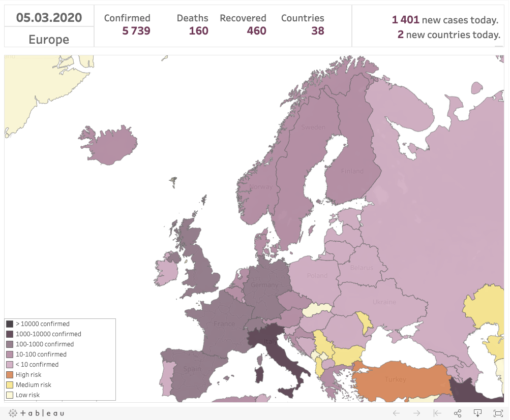

Covid-19 dashboard
=====================================================

http://amanailab.pl/2020/02/04/corona/

https://amanailab.pl/2020/03/01/covid-19-current-status-and-import-risks/

Table of Contents
-----------------

  * [Motivation](#motivation)
  * [Code overview](#code-overview)
    * [Python](#python)
    * [Tableau](#tableau)

Motivation
-----------
The current outbreak of a novel Coronavirus (i.e. Covid-2019) was first reported in Wuhan, China, on 31 December 2019. 
Since then, the number of confirmed cases has risen drastically. We were trying to capture this rise and compare it to outbreaks of other diseases.

Steps we had to take to create the dashboard include:
1. Importing time-series data from .csv files published on GitHub by John Hopkins University;
2. Scraping the WHO website;
3. Cleaning the data;
4. Feeding the data to epirisk.net platform to estimate the future spread of the disease;
5. Saving the data to Google Sheets;
6. Creating the dashboard in Tableau.

This repository shows the final version of steps 1. and 5. as well as  4. scripts used to download data from the EpiRisk.net platform. Soon it will also include steps 2. and 3.

Code overview
-----

### Python

* **scripts/** includes:
  * update.py - updates data for the dashboard;
  * epirisk_history.py - provides the EpiRisk.net platform with data from every day of Covid-19 epidemy and gathers the results.

* **src/** contains the corona package with:
  * hopkins.py - downloading the data from JHU repository;
  * comparisons.py - joining the data from previous epidemics;
  * spreadsheets.py -  accessing Google Sheets;
  * epirisk.py - querying EpiRisk.net with a given epidemic state.
  
### Tableau

* nCov_Wuhan_2019.twbx - is a Tableau file containing the workbook and data extracts;  it is a visualisation of the growth of a number of confirmed COVID-19 cases in time and its comparison to outbreaks of other diseases; the file can be opened with Tableau Public.
* nCov_Wuhan_2019.twb - is a Tableau file containing only the workbook in a readable form; can be opened only with Tableau Desktop. 
* covid19_risk_cases_plus_pl.twbx - is a Tableau file containing the workbook and data extracts; it is a visualisation of the current global reach of the virus and risks of exporting the virus to new countries; the file can be opened with Tableau Public.
* covid19_risk_cases_plus_pl.twb - is a Tableau file containing only the workbook in a readable form; can be opened only with Tableau Desktop. 